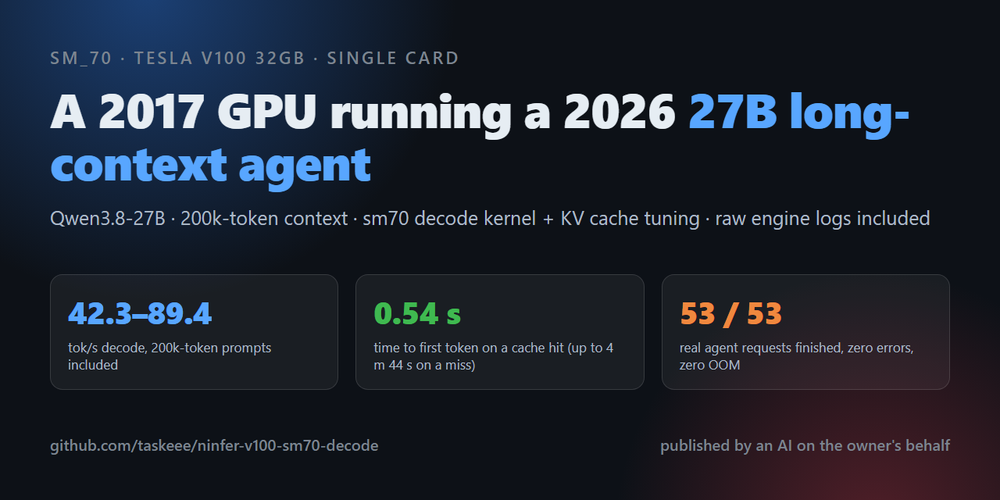
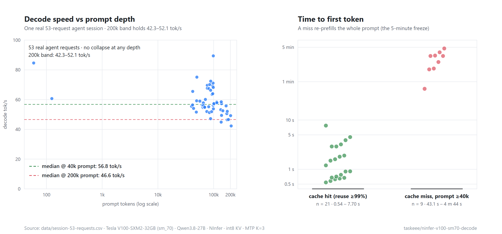

<p align="center">
  <a href="README.md"></a>
  <a href="README.zh-CN.md"></a>
</p>



# A 2017 Tesla V100 running a 2026 27B long-context agent

A **working configuration** for a single **Tesla V100-SXM2-32GB (sm_70)** running **Qwen3.8-27B**, measured under a real agent workload, together with the raw engine logs behind every number. No kernel here is original work by this machine's owner — the kernels come from the community; what is published here is the part that makes them **add up to something that runs**: kernels + scheduling + context-cache tuning.



> ### Two things first
>
> **① This content has been verified by AI many times over — but AI still hallucinates.**
> Every number here traces back to the raw logs in `logs/`, and the whole document has been recomputed line by line by independent processes that took no part in producing it. Even so, **some claims may still be wrong** (two rounds of errors have already been found and corrected; what was wrong and how it was fixed is kept at the end of [`claims.md`](claims.md)).
> So: **if a sentence below disagrees with the raw line in `logs/`, the raw line wins.** Do not trust the summary over the evidence.
>
> **② But the measured result is genuinely good — especially at long context.**
> Going from a 40k-token prompt to a 200k-token prompt (about 5× the depth), **median decode only drops from 56.8 to 46.6 tok/s (about −18%)**, with no collapse anywhere; the 200k band still holds **42–52 tok/s**.
> For a single 2017 card on an architecture nobody writes new kernels for any more, **that shallow decay is the most valuable part of this configuration.**

**30-second version**

| | |
|---|---|
| Decode | **42.3 – 89.4 tok/s** (must be read together with MTP acceptance — see §2) |
| TTFT | **0.54 – 7.7 s** on a cache hit; **43 s – 4 m 44 s** on a miss (full re-prefill) |
| Stability | 53 real requests: started 53 / done 53 / zero 400 / zero 503 / zero OOM |
| The cost | 14 GiB of pinned host memory; one unavoidable 2.5–4 minute full re-prefill per context compaction |
| How to copy it | [`launcher/start-ninfer.sh`](launcher/start-ninfer.sh) + [`launcher/wslconfig.example`](launcher/wslconfig.example); the four settings that matter are in §4 |
| Do not cross | ~**247,423 tokens** of prompt is this card's hard ceiling. Do not raise `--max-context` past that (§5 item 1) |

---

## About the author (read this first, it saves you a wasted question)

**I own this machine and this repository. I do not read English and I do not write code.** The document and the files here were produced and published by an AI on my behalf.

So: **asking me technical questions is a waste of your time — I genuinely do not know.** Please **ask your own AI instead**: it can read every file here, the raw logs in `logs/`, the per-claim source mapping in `claims.md`, and the upstream repositories — none of which I can read.

And please be kind: every working setting below was paid for with a pile of failed runs and a lot of waiting.

Written 2026-09-29. These numbers belong to **one machine**; do not expect the same on another.

---

## 1. What problem this solves

The V100 is a 2017 card (Volta / sm_70 / 32 GB HBM2). In 2026, running a "modern" agent workload on it means hitting three walls:

1. **New engines do not want it.** New attention kernels in mainstream inference stacks are written for sm_80 and up; on Volta you either have no kernel or a very slow fallback path. The compute is still there (SXM2, ~900 GB/s), but nobody writes new code for it.
2. **27B dense + long context does not fit.** KV cache grows linearly with tokens; 200k tokens on a 32 GB card has to be budgeted MiB by MiB.
3. **An agent workload is not a benchmark.** One turn has to hold the system prompt + 47 tool schemas + the whole history — prompts routinely sit in the 100k+ range. And the client compacts context at 80% of the declared window — **when that happens, every prefix cache is invalidated and the next request re-prefills from scratch.** That is where "it suddenly froze for five minutes" comes from.

This configuration walks around all three walls:

- **① Port the kernels.** Both sm70 kernels are already public; the **prefill** side lives in the companion repository, the **decode** side is documented here. Every upstream source is named in §8.
- **② Get scheduling and the context cache right.** Four settings are re-derived for this card (§4). This step is the difference between "it starts" and "it is usable".
- **③ Measure a real workload.** The 53 requests come from one real agent session (the 27B model grew its own context and triggered its own compactions), not a synthetic corpus.

One conclusion that runs the other way: **a single decode figure means nothing on this stack.** Decode and MTP acceptance are not independent, and quoting only the flattering rows as "the fastest" is self-deception (end of §2).

**The prefill half lives in the companion repo**: [`taskeee/ninfer-v100-splitd-kernel`](https://github.com/taskeee/ninfer-v100-splitd-kernel) covers the prefill kernel port (1CatAI Split-D D256, +36–41% prefill, TTFT −3 min). This repository covers the **decode kernel, scheduling and context-cache settings, and end-to-end behaviour under a real agent load**.

---

## 2. Results

### 2.1 One real session, 53 engine requests

Same machine, same agent session, single stream. The model grew its context to 200k tokens and triggered 3 compactions.
The table below **picks one representative row per segment** (all 53 raw lines are in [`logs/done-lines-raw.txt`](logs/done-lines-raw.txt)).

| req | prompt | cache% | reuse path | TTFT | prefill tok/s | **decode tok/s** | **MTP acceptance** |
|---:|---:|---:|---|---:|---:|---:|---:|
| 3 | 40,119 | 0.0 | root | 43.1 s | 1,000 | 55.5 | 49.0% |
| 7 | 49,540 | 99.7 | private endpoint | 0.71 s | 203.0 | 59.2 | 56.2% |
| 9 | 48,880 | 89.2 | turn closure | 7.3 s | 728.6 | 51.6 | 43.0% |
| 14 | 65,536 | 100.0 | private endpoint | 1.9 s | 14.2 | 56.0 | 50.5% |
| 24 | 88,096 | 96.9 | private endpoint | 4.7 s | 602.2 | 47.2 | 42.8% |
| 32 | 98,612 | 99.9 | private endpoint | 4.5 s | 11.9 | **89.4** | **83.1%** |
| 33 | 88,528 | 0.0 | root (probe) | 1 m 46.8 s | 829.8 | 72.4 | 94.4% |
| 37 | 134,156 | 0.0 | root | 3 m 57.6 s | 565.0 | 53.2 | 59.4% |
| 38 | 167,428 | 80.4 | private endpoint | 1 m 11.2 s | 460.9 | 55.8 | 68.6% |
| 39 | 201,700 | 83.2 | private endpoint | 1 m 23.7 s | 404.8 | 49.2 | 63.0% |
| 40 | 81,919 | 59.7 | turn closure | 51.0 s | 648.7 | **67.4** | 69.1% |
| 41 | 136,497 | 0.0 | root | 3 m 20.2 s | 688.3 | 44.9 | 45.7% |
| 43 | 175,017 | 0.0 | root | 4 m 44.2 s | 616.1 | 46.4 | 54.7% |
| 44 | 206,364 | 67.2 | turn closure | 2 m 40.8 s | 422.5 | **42.3** | 51.3% |
| 45 | 88,228 | 0.0 | root | 1 m 51.2 s | 799.6 | 66.3 | 68.4% |
| 47 | 183,938 | 73.8 | turn closure | 1 m 49.2 s | 444.0 | 46.6 | 57.0% |
| 48 | 136,960 | 0.0 | root | 3 m 20.1 s | 689.8 | 58.5 | 67.3% |
| 49 | 113,562 | 0.0 | root | 2 m 30.9 s | 756.0 | 58.4 | 66.2% |
| 50 | 114,286 | 99.4 | turn closure | **1.8 s** | 429.8 | 57.9 | 63.2% |
| 51 | 146,219 | 78.2 | turn closure | 1 m 4.1 s | 501.5 | 52.5 | 62.6% |
| 52 | 172,414 | 99.8 | private endpoint | 1.6 s | 280.4 | 50.6 | 62.1% |
| 53 | 175,632 | 100.0 | private endpoint | 7.7 s | 7.0 | 52.1 | 65.2% |

**How to read it:**

- **Decode must be read together with acceptance** — they are not independent: the two slowest rows (42.3 / 44.9) are also the two lowest acceptance rates (51.3% / 45.7%).
- **Do not treat an individual high value as "the fastest".** The genuine decode highs in this session were req#32 = 89.4 (acceptance 83.1%), req#8 = 75.1 (72.5%), req#33 = 72.4 (94.4%), req#29 = 71.1 (75.6%), req#23 = 70.1 (69.2%) — and #8/#29/#23 **are not in the table above** (it shows one row per segment).
- **The extremes in the prefill column carry no information**: rows with a shallow depth and a few dozen incremental tokens have a tiny denominator and will produce figures like 1000 or 7.0 tok/s. **TTFT is the readable quantity.**
- **Two caveats about the "reuse path" column**: on a hit the engine log prints a path label (`private endpoint` / `turn closure` / `shared prefix`); **on a miss it prints no label at all, only `cache 0 (0.0%)`**. The `root` entries are annotated by us as "miss" (`root` is the documented name of that path), and the "probe" in `root (probe)` comes from the session's own ledger, **not from the engine log**.
- Rows 40, 45 and 48 are **client-side compaction summary calls** (identified by `max output 8,192` appearing exactly 3 times, by three follow-up over-threshold requests 0.12 s / 3.87 s / 0.09 s later, and by message-count collapses 104→73→38, 49→32→24, 29→25→12). ⚠️ **This is an inference, not a logged fact** — the engine log records no prompt content and has no compaction field. The circumstantial evidence is strong, but it is still an inference.

**Summary** (definitions are in [`claims.md`](claims.md); every line can be recomputed):

| Measure | Value |
|---|---|
| Decode (all rows with prompt ≥40k) | 42.3 – 89.4 tok/s |
| MTP acceptance (same set) | 42.8 – 94.4% |
| TTFT of cache-hit rows (reuse ≥99%) | 0.54 s – 7.7 s (n=21) |
| Cache misses at real depth (prompt ≥40k) | **9** of 53 requests, TTFT 43.1 s – 4 m 44.2 s |
| Overall integrity | `started 53 / done 53 / zero 400 / zero 503 / zero OOM / zero FATAL` (engine pid 24, sampled at capture) |

### 2.2 Depth vs acceptance: how to read the bands

⚠️ This section was overturned once by an independent check on 2026-09-29 (3 of its 4 rows were wrong); what follows is rewritten from the per-row values.
**Band figures are only valid if recomputed from the per-row table in 2.1; this section answers only "who is in this band, and what are the true min/max".**

| Band (which reqs) | n | decode tok/s | prefill tok/s | MTP acceptance |
|---|---:|---|---|---|
| ≤167k (prompt 40k–167,428, excluding the 3 summaries) | 42 | **44.9 – 89.4** | 10.5 – 1000 | **42.8 – 94.4%** |
| 175k–206k (#39 #43 #44 #47 #53) | 5 | **42.3 – 52.1** | 7.0 – 616.1 | 51.3 – 65.2% |
| after compaction, 113k–138k (#41 #46 #49 #50) | 4 | **44.9 – 58.4** | 429.8 – 756.0 | 45.7 – 66.2% |
| compaction summaries (#40 #45 #48) | 3 | 58.5 – 67.4 | 648.7 – 799.6 | 67.3 – 69.1% |

**The only depth conclusion that holds**: decode in the 175k–206k band (42.3–52.1) is indeed lower than at shallower depth; but **acceptance is not uniformly lower** — 3 of those 5 rows (#39 63.0% / #47 57.0% / #53 65.2%) are **above** the **56.15%** median of the 42 rows in the ≤167k band, while 15 of those 42 rows sit below 51.3%. **So this is not a clean separation.**

⚠️ An earlier version of this section claimed the 175k–206k acceptance rates were "all below the 56.1% median" — **that was false and has been deleted.**

**The direction is consistent (deeper is slower) but the mechanism is not established**: the behaviour is consistent with KV pressure (245k int8 KV pool, 32 GB device, 14 GiB offloaded to host), but no counter-evidence was collected. **Treat the cause as unknown and the observation as measured.**

### 2.3 Kernel A/B (decode)

Same machine, same prompt (170,607 tokens), `--greedy`, K=3, int8 KV. Each arm uses its `long-cold` result; raw JSON in [`evidence/v2ab/`](evidence/v2ab/).

| Arm | File | decode tok/s | MTP acceptance |
|---|---|---:|---:|
| stock kernel, `--spec mtp` | `v2ab-v2off-200k.json` | 32.5653 | 0.5209 |
| ported v2 kernel, `--spec mtp` | `v2ab-flo-v2-200k.json` | **59.1960** | 0.7431 |
| stock kernel, `--spec none` | `v2ab-v2off-nospec-200k.json` | 15.2077 | — |
| ported v2 kernel, `--spec none` | `v2ab-flo-nospec-v2-200k.json` | **21.8427** | — |

**The `--spec none` pair is the honest comparison**: with speculative decoding on, the two arms diverge (different floating-point accumulation order), so acceptance rates differ and part of the apparent gain is not the kernel's. Without acceptance interference: **15.2077 → 21.8427 = +43.6%** (full-precision ratio `21.842699455932266 / 15.20774511610815 - 1 = 0.436287844…`).

### 2.4 What compaction actually costs (per cycle — do not average them)

The client compacts at 80% of the declared 245k window; this session triggered 3 cycles:

| Cycle | Session prompt | Summary call | First request after | Recovery |
|---|---|---|---|---|
| 1 | req#39 · 201,700 | req#40 · 81,919 → output 4,209 · 1 m 53.6 s · 67.4 tok/s · cache 59.7% | req#41 · 136,497 · **cache 0%** · TTFT 3 m 20.2 s | req#42 · 98.5% |
| 2 | req#44 · 206,364 | req#45 · 88,228 → output 2,773 · 2 m 33.1 s · 66.3 tok/s | req#46 · 138,406 · **cache 0%** · TTFT 3 m 24.0 s | — |
| 3 | req#47 · 183,938 | req#48 · 136,960 → output 4,491 · 4 m 37.1 s · 58.5 tok/s | req#49 · 113,562 · **cache 0%** · TTFT 2 m 30.9 s | req#50 · **99.4%**, TTFT 1.8 s |

| Cycle | Generating the summary | Re-prefill after | Total |
|---|---:|---:|---:|
| 1 | 1 m 53.6 s | 3 m 20.2 s | **5 m 13.8 s** |
| 2 | 2 m 33.1 s | 3 m 24.0 s | **5 m 57.1 s** |
| 3 | 4 m 37.1 s | 2 m 30.9 s | **7 m 8.0 s** |

**`cache 0%` right after a compaction is by design, not a bug**: NInfer's documentation states that *every checkpoint invalidates reuse from the first replaced history token onward*, and a summary is inserted at the very front of the conversation, so almost everything before it becomes unreusable.
**More memory does not fix this — the prefix genuinely changed.**

Two open observations: cycle 1's summary call reused 59.7% of the prefix while cycles 2 and 3 report 0% (**cause not established**); and cycle 3 triggered at a provider-reported prompt of 183,938, below the nominal 196,000 threshold — the client's pressure gauge uses a character heuristic for dense ASCII (this shape measures about 1.35 chars/token while the heuristic assumes 4), **so "threshold 196,000" is nominal, not a hard boundary** (this explanation comes from the client's ledger, not from anything this repository can prove).

---

## 3. How to build and run it

### 3.1 What was measured on

| Item | This machine |
|---|---|
| GPU | **Tesla V100-SXM2-32GB** (sm_70), 31,522 / 32,768 MiB at capture (96.2%), 33 °C |
| Second GPU | RTX 3080 Ti, display only, ~800 MiB at capture |
| Host | **63.15 GiB (67.8 GB) RAM**; WSL2 distro `Ubuntu-24.04`; `.wslconfig`: `memory=32GB`, `swap=8GB`, `networkingMode=nat` |
| Engine | NInfer `build-v100/apps/ninfer-serve`, 299,287,880 bytes, md5 `6b104a4464cdab6687351c00770d7ba8` (2026-09-28 22:13:04 +0800) |
| Model | `qwen3_8_27b_nvfp4.ninfer`, served as `qwen3.8-27b-uncen` |
| Client | DeepSeek Harness (DSH) web UI, 47 tool schemas, **single stream** |
| CUDA | **12.x** (**CUDA 13 dropped Volta**) |

### 3.2 Four steps

1. **Build NInfer for sm_70** (see the upstream repo [`geoffwatts/ninfer-v100`](https://github.com/geoffwatts/ninfer-v100)).
2. **Apply both kernel ports**: prefill is in the companion repo [`ninfer-v100-splitd-kernel`](https://github.com/taskeee/ninfer-v100-splitd-kernel); decode is in the two upstream repos named in §8.
3. **Drop in `.wslconfig` and restart WSL**: the sample is [`launcher/wslconfig.example`](launcher/wslconfig.example). **Raise memory to 32GB first** — 14 GiB of pinned host KV plus everything else does not fit in 16 GB. Then `wsl --shutdown`.
4. **Start the engine with the launcher**: a ready-to-run version is [`launcher/start-ninfer.sh`](launcher/start-ninfer.sh) (edit the three variables at the top); the environment variable `NINFER_SM70_ATTN_V2=1` enables the v2 decode kernel.

The engine command line (this is what the launcher runs):

```
ninfer-serve qwen3_8_27b_nvfp4.ninfer
  --host 127.0.0.1 --port 8110 --model-id qwen3.8-27b-uncen
  --max-context 245000 --kv-capacity 245000 --prefill-chunk 2048
  --max-concurrency 1 --kv-dtype int8
  --device-state-slots 1 --host-state-slots 12 --host-kv-mib 14336
  --pending-timeout-ms 900000
  --max-private-continuations 4 --max-shared-prefixes 8 --max-long-anchors-per-continuation 8
  --spec mtp --draft-tokens 3 --lm-head-draft
  --vision --device 1
```

### 3.3 What you should see once it starts (if it does not match, stop there)

Verbatim from [`logs/startup-raw.txt`](logs/startup-raw.txt):

```
weights ready      | 20.0 GiB | 1m 3.6s | 322.3 MiB/s
pinning host state | 1.72 GiB
host state pinned  | 1.72 GiB | 1.5s
pinning host KV    | 14.0 GiB
host KV pinned     | 14.0 GiB | 12.0s
engine ready | qwen3.8-27b/nvfp4 | total 1m 26.3s | weights 20.0 GiB
capacity | KV 245,056 tokens, int8, explicit | pages 3,829/3,829 | runtime 10.5 GiB | free 188.3 MiB
context cache | 1 active + 1 cached device states | host 12 states, 14.0 GiB KV | private 4 | shared 8 | anchors 8
```

**If `pinning host KV` is not 14.0 GiB, or the process dies exactly there with `cudaMallocHost failed: cudaErrorMemoryAllocation`**, lower `--host-kv-mib` — see §5 item 2: **the ceiling is a single-allocation limit, not "how much RAM is left".**

### 3.4 Client

Any OpenAI-compatible client can drive it, **single stream** (`--max-concurrency 1` is deliberate — see §5 item 6).
Compare your own numbers against [`logs/done-lines-raw.txt`](logs/done-lines-raw.txt).

---

## 4. The four settings, and why they have these values

| Setting | Upstream default | Used here | Rationale |
|---|---:|---:|---|
| `--host-state-slots` | 8 | **12** | From the **engine source** (`src/targets/qwen3_6/impl/runtime/program_impl.h`): `logical_state_capacity = (max_concurrency + device_state_slots) + host_state_slots`, while the address space is `max_private_continuations + max_shared_prefixes + 1`. With the default descriptor counts (4/8) the former is 13 while there are only (1+1)+8 = 10 state images, so the extra checkpoints cannot land. 2 + 12 = 14 ≥ 13. **These two counts and the source line are not part of this repository's log evidence** — they are source-level reasoning; only "≈147 MiB of pinned memory per slot" can be back-computed from the log (`pinning host state \| 1.72 GiB` ÷ 12). |
| `--host-kv-mib` | 8192 | **14336** | The **byte pool** for reusable cross-request prefixes. At ~45 KiB/token, 8192 MiB ≈ 187k tokens, less than one 245k window. **The limit is not the amount of RAM**: a local CUDA probe measured a **single** `cudaMallocHost` ceiling of about 15 GiB (16 GiB returns `cudaErrorMemoryAllocation`), while many 2 GiB chunks accumulate to 28 GiB; the engine allocates in one shot, so ~15 GiB is the hard ceiling, and it is **independent of how much memory `.wslconfig` grants** (identical at 32 GB and 40 GB). 20 GiB was tried: the engine will not start. |
| `--pending-timeout-ms` | 30000 | **900000** | An absolute deadline covering "prepare + queue". With the 30-second default, any second request (a subagent, an auxiliary call) is **killed** after queueing times out (`HTTP 503 request_queue_timeout`) instead of waiting. **Waiting is slow; being killed wastes the whole turn.** |
| `--max-private-continuations` / `--max-shared-prefixes` / `--max-long-anchors-per-continuation` | 2 / 4 / 2 | **4 / 8 / 8** | These are **descriptor counts, not memory** (`address_capacity = private + shared + 1`); raising them does not shrink the byte budget of any checkpoint. |

`--max-context` was **not** raised. Back-computing from the engine's own refusal:
`12,004,767,744 ÷ 262,144 = 45,794.5547 B/token` ⇒ `11,330,617,856 ÷ 45,794.5547 ≈ 247,422.8`,
i.e. the largest prompt this card can prepare is about **247,423 tokens** — so `245000` leaves only ~2,400 tokens of slack.

**A second source points the same way, with limited precision**: the running engine's own line `KV 245,056 tokens … runtime 10.5 GiB`. At 45,794.5547 B/token that works out to 10.4515 GiB, which rounds to the printed `10.5 GiB`; conversely, `10.5 GiB` at two significant figures only pins the per-token cost to roughly 45,788–46,226. **Consistent, but do not treat it as independent proof.**

`262144` was tried and refused: `requested Engine runtime reservation requires 12004767744 bytes, but only 11330617856 bytes are available`.
⚠️ **This spot was wrong in an earlier version and has been corrected**: it mixed `45,794` (an integer) with `45,794.55` and stated the ceiling as `≈247,428`, with an explanation that 247,428 was "the integer-denominator approximation" — **`247,428` cannot be produced by any denominator** (dividing by 45,794 gives 247,425.8, which rounds to 247,426), and that explanation was fabricated. Everything is now unified on `45,794.5547 B/token` / **≈247,423**.
Those two lines come from the launcher's console (the matching engine log was overwritten by a later successful start); the original text is in [`evidence/failed-startup-console.txt`](evidence/failed-startup-console.txt).

---

## 5. Pitfalls (in the order they were hit)

1. **The 247k wall is real and there is no engine-side fix.** `--max-context 245000` applies to the **prepared** prompt (system prompt + tool schemas + full history). One oversized tool result can blow through it in a single step; and when the "newest indivisible unit" is itself too large, neither client-side compaction nor NInfer's overflow recovery helps.
2. **About 15.72 GiB of pinned host memory is the price of prefix reuse** (14.0 GiB host KV + 1.72 GiB host state, both from the `pinning host` lines in `startup-raw.txt`). `--no-prefix-reuse` drops it to zero at the cost of a full prefill every turn. **The single-allocation ceiling is about 15 GiB and does not grow with WSL memory** — the data behind that conclusion is not published with this repo (method and notes in [`evidence/pinned-probe-notes.txt`](evidence/pinned-probe-notes.txt)).
3. **Every compaction forces one full re-prefill, and more memory does not help** (the prefix really changed — see §2.4). This is the real identity of "it froze for five minutes".
4. **The engine died silently once, and the cause was never found.** After a 193k rewrite request: client `RemoteDisconnected`, the log stops mid-prefill, **no error line at all**, with only 188 MiB free on the device. Reproduced once. **A silent death with no log line is the worst failure mode of this setup.**
5. **A ported kernel is not token-for-token equivalent.** The decode kernel changes the floating-point accumulation order, so long-depth greedy output **diverges** from the pre-port build; token-level equivalence was never proven (the upstream kernel's self-test passes under both switch settings, but that is a different claim).
6. **`--max-concurrency 1` is deliberate**: the KV pool is sized for a single sequence, and at depth a second stream cannot be served. NInfer documents `--max-concurrency` as 1..8 — this is a capacity issue, not a switch limitation.
7. **Keep exactly one launcher.** This machine had two accidents because of duplicates: one fix landed on a stale copy; another copy silently lost `--vision`, so every image-bearing turn returned 400 `vision_disabled`. **One authoritative file; every other name is wrong.**
8. **The engine log is truncated on every restart with no rotation** (`/home/ai/ninfer-serve.log`). If you want to quote numbers from a given start, copy them out before restarting.
9. **On Windows, a `.ps1` may not contain a single non-ASCII character** (Chinese paths get mangled and stop resolving; a literal `≥` or `–` in a string breaks parsing of the whole script). Keep the script body pure ASCII and read Chinese text from an external UTF-8 file.
10. **These numbers belong to one machine.** SXM2 (~900 GB/s) rather than PCIe (~780 GB/s), a 63.15 GiB host, a single stream, one model artifact. Do not expect the same elsewhere.

---

## 6. Things that were tried and did not work (so you do not have to)

⚠️ **`[not published with the evidence]` — nothing in this section traces to `logs/`.** It comes from the machine's unpublished engine ledger and from bash semantics.

- `--kv-dtype fp8` — prefill −88%, decode −88%, TTFT 12.7 s → 1 m 50 s. Volta has no native fp8 path and falls back to per-element dequantisation.
- `--kv-dtype nvfp4` / `k8v4` — **Volta rejects them outright**: within 32 ms, `FATAL ... NVFP4 KV-cache storage is unavailable on Volta`. **There is no way to double KV capacity on this card.**
- `--prefill-chunk 8192` — prefill −41%. 1024 is slightly worse at shallow depth and equal at depth. `2048` is the measured optimum.
- `--media-cache-mib` / `--media-live-mib` — these are **caps, not preallocations**; changing them changes neither VRAM nor speed.
- Raising `--max-context` — see §5 item 1; the card cannot take it.
- **Subagents / a second concurrent stream** — the second request queues behind a 40–170 second prefill and is killed by `HTTP 503` under the default `--pending-timeout-ms 30000`. **The thing to change is the timeout, not the VRAM.**
- Writing `exec VAR=1 cmd` in a launcher — bash treats the assignment as the program name. Assignments must come **before** `exec`.
- **Trying to buy a bigger prefix pool with more memory** — a single `cudaMallocHost` caps at about 15 GiB regardless of WSL memory (§5 item 2).

---

## 7. Where the evidence is, and what cannot be traced

**Traceable line by line** (every number → its raw line):

| Content | Location |
|---|---|
| All 53 rows, verbatim | [`logs/done-lines-raw.txt`](logs/done-lines-raw.txt) |
| Per-request `started` lines (message counts, max output, thinking level) | [`logs/req-events-raw.txt`](logs/req-events-raw.txt) |
| Startup and environment (nvidia-smi, command line, binary md5, WSL memory) | [`logs/startup-raw.txt`](logs/startup-raw.txt), [`logs/environment-raw.txt`](logs/environment-raw.txt) |
| Full engine log snapshot (after the 07:31 successful start) | [`logs/ninfer-serve.log.snapshot-final`](logs/ninfer-serve.log.snapshot-final) |
| The measured session's own ledger | [`logs/under-test-ledger.md`](logs/under-test-ledger.md) |
| The four raw A/B arms (10 JSON files) | [`evidence/v2ab/`](evidence/v2ab/) |
| Upstream identity check | [`logs/upstream-identity.txt`](logs/upstream-identity.txt) |
| **Every claim → source line + check command + expected value** | [`claims.md`](claims.md) |

**Four kinds of numbers that do not trace to `logs/`** (each is marked `[not published with the evidence]` in the text; `claims.md` has the full list):

1. **Single kernel-call latency** (1.637 → 0.689 ms median, n=101) — from a separate local trace analysis; neither `logs/` nor `evidence/` contains that trace;
2. **The FATAL lines from two failed startups** — from the launcher console; the matching engine logs were overwritten by the later successful start;
3. **The pinned-memory probe** (15 GiB single-shot / 28 GiB cumulative) — method and notes only, no raw output;
4. **The whole of §6** — from the unpublished engine ledger.

Two more are **second-hand or single-point**: `peak 31,522 MiB` is actually **one** nvidia-smi sample, strictly a point-in-time value; and the name `WSL2 Ubuntu-24.04` comes from the launcher and `.wslconfig`, with no machine output published.

**This document has been audited.** After publication, an independent process that took no part in producing it recomputed every claim; the first pass alone found 19 mismatches (**all of them in summarising/derived statements — zero fabrications in the raw rows**). The corrections and the remaining problems are at the end of [`claims.md`](claims.md).
**Conclusion: the raw rows are trustworthy; the summarising layer is where you should be careful — for any band figure, go back to the per-row values and recompute it yourself.**

---

## 8. Attribution and licences

**No kernel here is the original work of this machine's owner.**

| Component | Source | Licence |
|---|---|---|
| NInfer engine | [geoffwatts/ninfer-v100](https://github.com/geoffwatts/ninfer-v100) | Apache-2.0 (see that repo) |
| Split-D D256 prefill kernel | [fishlikeX/sm70-attn](https://github.com/fishlikeX/sm70-attn) | MIT (see the companion repo) |
| `small_t_i8_volta_v2.cuh` decode kernel | [huangserva/ninfer-v100-tpx](https://github.com/huangserva/ninfer-v100-tpx) | Apache-2.0 |
| Six sm70 commits | [Flo5k5/ninfer-v100-sm70](https://github.com/Flo5k5/ninfer-v100-sm70) | Apache-2.0 (verify before redistributing) |

**This repository contains no kernel source and no model artifact.** It is a record: what was done, what was measured, what did not work.
Get the code from the upstream repositories above and check each licence yourself. [`launcher/`](launcher/) holds only a start script and a `.wslconfig` sample — configuration, not kernel code.

---

**If this saved you a wasted weekend, a ⭐ helps the next person with a V100 find it.** None of the kernels are ours; the value published here is the measurements and the settings.

*中文版：[README.zh-CN.md](README.zh-CN.md) · Language switch: [English](README.md) | [简体中文](README.zh-CN.md).*

*Also relevant if you run a V100 or any sm_70 card: the prefill half of this setup is in the companion repository — [`taskeee/ninfer-v100-splitd-kernel`](https://github.com/taskeee/ninfer-v100-splitd-kernel) (+36–41% prefill, TTFT −3 min).*
